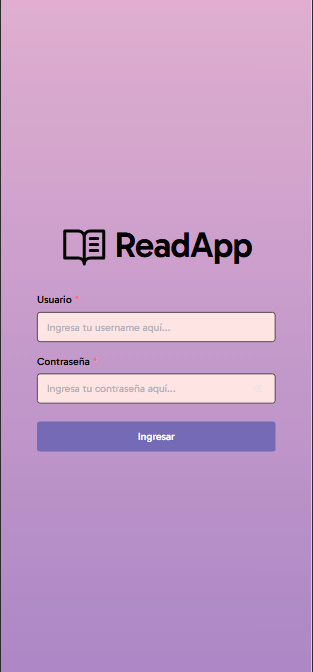

# ReadApp - React

## Sobre el proyecto
Este proyecto es una pequeña aplicación web de _back-office_ para ReadApp, una red social de difusión de libros desarrollada colaborativamente como parte de la materia Algoritmos 3 de la Tecnicatura Universitaria en Programación Informática de la UNSAM. La aplicación se conecta con un [servidor](https://github.com/franncoronel/readapp-backend) Spring Boot desarrollado en el lenguaje de programación Kotlin mediante una RESTful API.
## Vistas
#### Login
El login es muy sencillo: recibe los datos de un usuario, valida los campos y el botón **Ingresar** dispara la autenticación. Este proceso verifica que el usuario exista en el back-end y que tenga los permisos requeridos.

[Login fallido por permisos denegados](videos/login-fallido-permisos.gif)
#### Home
#### Seccion de Autores
#### Seccion de Libros
