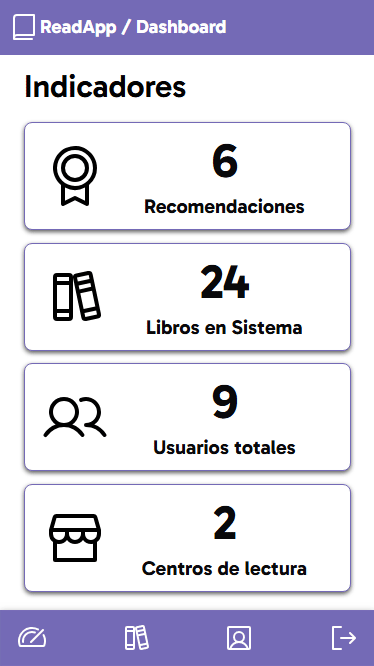

# ReadApp - React

## Sobre el proyecto
Este proyecto es una pequeña aplicación web de _back-office_ para ReadApp, una red social de difusión de libros desarrollada colaborativamente como parte de la materia Algoritmos 3 de la Tecnicatura Universitaria en Programación Informática de la UNSAM. La aplicación se conecta con un [servidor](https://github.com/franncoronel/readapp-backend) Spring Boot desarrollado en el lenguaje de programación Kotlin mediante una RESTful API.
## Vistas
### Login
El login es muy sencillo: recibe los datos de un usuario, valida los campos y el botón **Ingresar** dispara la autenticación. Este proceso verifica que el usuario exista en el back-end y que tenga los permisos requeridos.

[Login fallido por permisos denegados](videos/login-fallido-permisos.gif)
### Home
Tras un login exitoso, el usuario accede al _dashboard_, donde puede consultar la cantidad de recomendaciones, libros, usuarios y centros de lectura que forman parte de la base de datos.
> Debido a los contenidos de la materia, la base de datos se almacena en memoria, no hay una BBDD externa.

El usuario puede manipular los contenidos de la base de datos realizando dos procesos de administración:
- Eliminar los centros de lectura expirados, es decir, aquellos cuya fecha de finalización es anterior a la fecha actual o que alcanzaron el tope de participantes.
- Eliminar los usuarios inactivos, que son aquellos usuarios que no generaron ni evaluaron recomendaciones y que no forman parte de la lista de amigos de otros usuarios.

Estos procesos de administración requieren validaciones complejas en el backend. Querer efectuarlas cuando ningún usuario o centro de lectura cumple con las condiciones arroja un error:

### Sección de Libros
### Sección de Autores

En la sección de autores se pueden visualizar a todos los autores que forman parte de la base de datos de la aplicación. Aquí el usuario puede
- Buscar autores
- [Editar los datos de un autor](videos/editar-autor-exito.gif)
- [Agregar un nuevo autor a la base de datos](videos/crear-autor-exitoso.gif)
- [Eliminar a un autor siempre y cuando estén dadas las condiciones para hacerlo.](videos/borrar-autores-exito-y-falla.gif)
